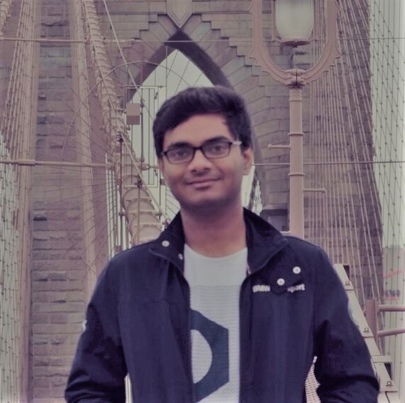

I am Subhankar Ghosh, currently pursuing Masters of Science in Statistics with Analytics Concentration in University of Illinois at Urbana-Champaign. I am currently doing research on Stylometry in Research papers using deeplearning and NLP techniques at UIUC. In my masters I am mainly focussing on Statistical Analysis of Data, Machine Learning, Natural Language Processing and Deep Learning.

I have worked as a Software Engineer in Microsoft R&D India for two years (2015 - 2017) after I graduated from National Institute of Technology, Rourkela where I majored in Computer Science in the year 2015.

Mostly self taught before joining UIUC in the Master's program. In the master's program I am learning the concepts in-depth and I am really hungry for more. This kind of interest instills in me the impetus for research in the field of  Machine Learning, Natural Language Processing and Deep Learning. And in this process of learning and exploring I intend to solve some of the very evident and impact-ful problems in the industry. Today Data Science is a big part of me and I can’t wait to make it an even bigger part of me in UIUC.

[Resume](SubhankarResume.pdf)

[Linkedin](https://www.linkedin.com/in/subhankar-19)

[Kaggle](https://www.kaggle.com/sugh93)

